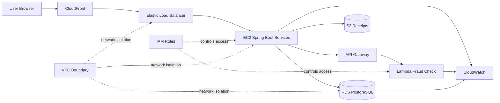
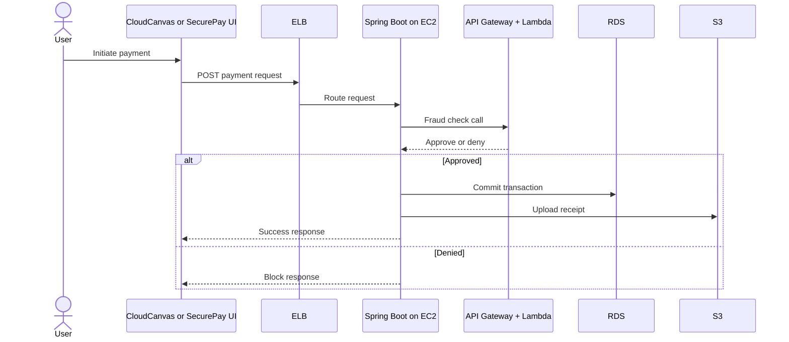
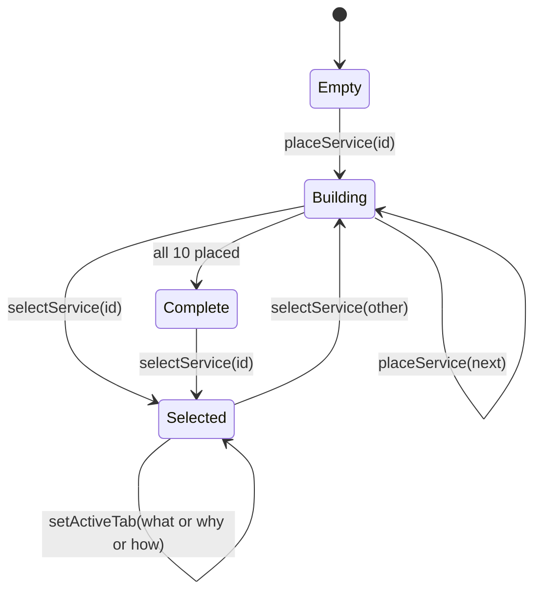
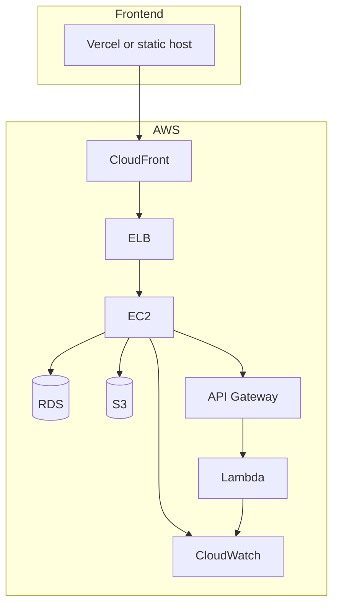

# CloudCanvas

CloudCanvas is an interactive React and Next.js experience that teaches AWS architecture through a real payment system narrative. Instead of static slides, users build an architecture canvas, run a simulated payment journey, review evidence, and understand why cloud design choices matter.

## Highlights

- Interactive architecture canvas with 10 AWS services
- Service-level learning tabs: what, why, and how
- Payment flow demo player with service highlighting
- Evidence wall ready for real AWS screenshot proof
- Cost and deployment storytelling for presentation use
- Mermaid documentation for architecture and process diagrams

## AWS Services Covered

- VPC
- IAM
- EC2
- RDS
- S3
- Lambda
- API Gateway
- CloudFront
- ELB
- CloudWatch

## Tech Stack

- Next.js 16
- React 19
- TypeScript
- Tailwind CSS
- Framer Motion

## Quick Start

### 1) Install dependencies

```bash
pnpm install
```

### 2) Run development server

```bash
pnpm exec next dev --webpack -p 3000
```

Open http://localhost:3000

### 3) Production preview locally

```bash
pnpm build
pnpm start
```

## Data and Logic Layer

Primary logic and data modules:

- src/data/services.ts
- src/data/demoSteps.ts
- src/data/evidence.ts
- src/hooks/useArchitectureCanvas.ts
- src/hooks/useDemoPlayer.ts

These files are intentionally structured so UI components can consume them without prop API changes.

## Mermaid Diagrams

### 1) System Architecture



### 2) Payment Processing Sequence



### 3) Architecture Canvas State



### 4) Deployment Topology



## Professional Repository Notes

- Credentials are not stored in source files.
- Environment files are ignored via gitignore.
- Build artifacts and local runtime folders are excluded from git.
- Keep production secrets only in platform-managed environment variables.

## Roadmap

- Add real evidence screenshots in public and map them to src/data/evidence.ts
- Wire permanent live demo and GitHub links in UI actions
- Add CI workflow for linting, type checks, and build

## Author

Rishi Raj