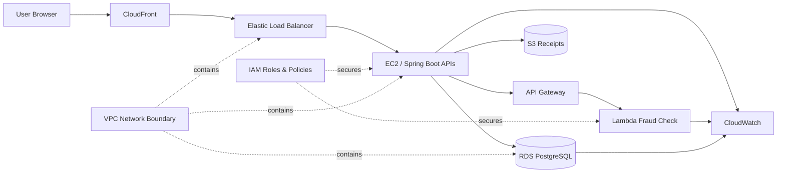
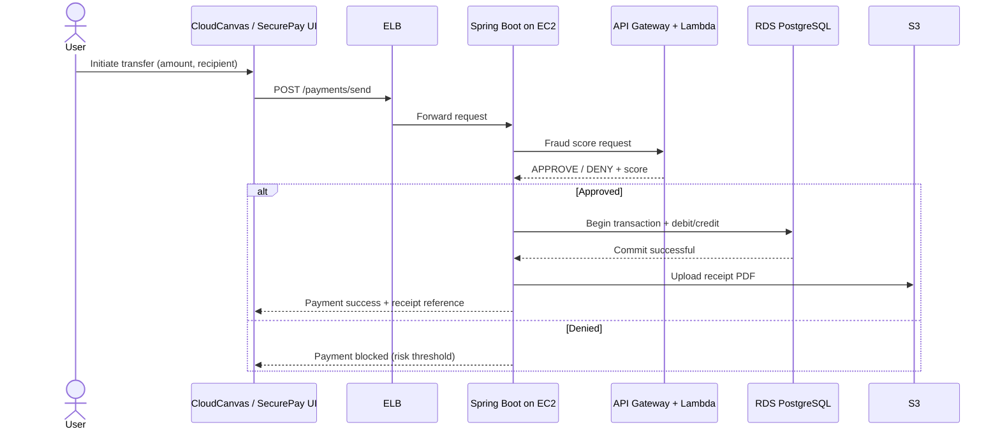
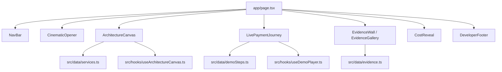
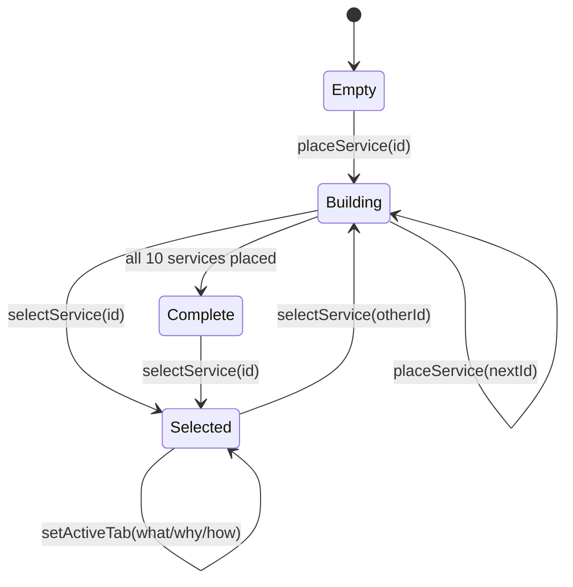
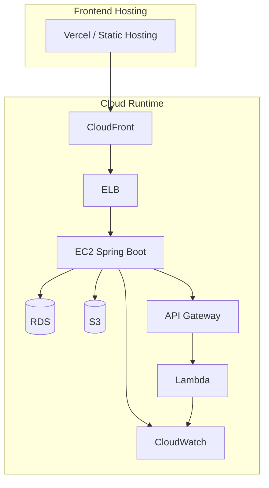
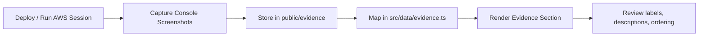

# CloudCanvas Mermaid Diagrams

This document provides Mermaid definitions for the major technical views in the project.
You can render these in Mermaid-compatible viewers.

## 1) System Architecture

## 2) Payment Request Sequence

## 3) CloudCanvas UI Section Map

## 4) Canvas State Machine

## 5) Deployment Topology

## 6) Evidence Collection Workflow

